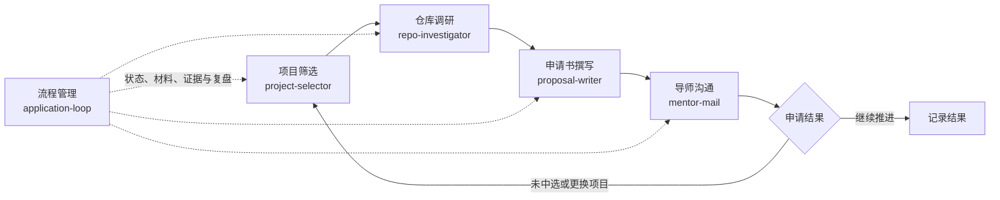

# OSPP Application Skills

一组面向“开源之夏”（OSPP）项目申请的 Agent Skills。目标是将选项目、代码调研、申请书撰写和导师沟通串成可重复的流程，实现一条龙服务。

[](https://agentskills.io)
[](LICENSE)

本项目是社区工具，与开源之夏官方及具体开源社区无隶属关系。项目状态、申请规则和模板应以当年官方页面为准。

当前 skill 拥有项目筛选、仓库调研、申请书撰写、导师邮件和申请流程管理五个功能。

## 当前内容

```text
ospp-application-skills/
├── ospp-project-selector/
│   ├── SKILL.md
│   ├── agents/openai.yaml
│   └── references/
│       ├── candidate-profile.md
│       └── handoff-schema.md
├── ospp-repo-investigator/
│   ├── SKILL.md
│   ├── agents/openai.yaml
│   └── references/
│       ├── evidence-status.md
│       ├── investigation-report.md
│       └── handoff-schema.md
├── ospp-proposal-writer/
│   ├── SKILL.md
│   ├── agents/openai.yaml
│   └── references/
│       ├── evidence-ledger.md
│       ├── proposal-checklist.md
│       ├── review-workflow.md
│       ├── source-policy.md
│       └── template-example-calibration.md
├── ospp-mentor-mail/
│   ├── SKILL.md
│   ├── agents/openai.yaml
│   └── references/
│       ├── mail-style.md
│       └── reply-workflow.md
├── ospp-application-loop/
│   ├── SKILL.md
│   ├── agents/openai.yaml
│   └── references/
│       ├── record-schema.md
│       └── transition-rules.md
└── figures/
    ├── ospp-application-workflow.mmd
    ├── ospp-application-workflow.md
    └── ospp-application-workflow.png
```

`SKILL.md` 是通用的 Agent Skills 入口，Claude Code、Codex 等支持该格式的工具都可以使用。`agents/openai.yaml` 只提供 Codex 的界面元数据，其他工具忽略它即可。

## ospp-project-selector

根据用户的简历和自然语言偏好，从 OSPP 当前尚未中选的项目中筛选若干候选项目。

输入示例：

```text
我的简历在 /path/to/resume.pdf。
我想找 Agent、系统、评测或者 AI x 安全这类有探索性的项目，
不想做纯 CRUD、单纯适配或重复功能开发。推荐 3 个给我。
```

skill 会自行从简历和描述中识别偏好，并只在硬件、集群或项目周期等关键限制不明确且会改变结果时追问。

每个推荐会说明：

- 项目实际要做什么，以及其官方页面和项目编号；
- 与简历和偏好的匹配点、能力缺口；
- 探索性、工程负担、评测条件和周期风险；
- 可观察的热度或竞争信号，以及无法从公开信息确认的部分；
- 为什么推荐或排除，以及下一步应调研的仓库问题。


## ospp-repo-investigator

用户选定项目后，调研官方要求与真实仓库，定位目标分支、源码调用链、需要修改的模块、现有测试和 Benchmark，并尽量完成基线编译、测试或最小运行验证。

典型输入：

```text
使用 $ospp-repo-investigator 调研这个项目，看看仓库里已经有什么、
具体需要改哪里，以及项目周期内是否做得完：
https://summer.ospp.ac.cn/org/prodetail/xxxxxxxxx?lang=zh&list=pro
```

调研结论会区分 `verified`、`partial`、`inferred`、`blocked` 和 `contradicted`，避免把静态代码存在、仓库编译成功或设计推测误写成已经验证的功能。最终输出可以直接交给后续申请书和导师邮件 skill 使用。

## ospp-proposal-writer

根据当年官方模板、项目要求、仓库调研结果、简历和真实验证记录撰写或修改申请书。正式动笔前必须先完成两项材料校准：逐项提取官方模板中的必填内容、格式和文件命名规则；从 OSPP 推荐的优秀申请书中提炼结构、技术粒度、仓库依据、可行性证据和时间规划方式。缺少任一材料时只能生成明确标注的预备稿，不能宣称已经达到提交标准。

仓库当前记录了维护者提供的 `项目申请模板.pdf` 与 `项目申请书示例.pdf` 的提炼结果，但不分发原 PDF。实际使用时仍应提供当年官方模板和优秀示例；新一年的官方模板始终优先于仓库内的既有提炼结果。

```text
使用 $ospp-proposal-writer，根据这个项目的官方要求、仓库调研报告和我的简历撰写申请书。
申请书用中文 Markdown，技术方案需要对应现有源码，不要写得像通用 AI 文案。
```

该 skill 支持新建、修改和审查三种使用方式。

申请书完成后可以选择启用独立模型审阅。审阅默认关闭，既可以由 Claude Code 负责写作、GPT 负责审阅，也可以由 GPT 写作、Claude Code 通过 MCP 审阅。审阅器只提出有证据的具体问题，主写模型会记录接受和拒绝的建议，避免把申请书改成长篇套话或典型 AI 文风。

```text
使用 $ospp-proposal-writer 撰写申请书，并启用独立审阅。
主写使用当前模型，审阅使用 Claude Code MCP 的 Opus 模型，只进行一轮。
```

不需要外部审阅时可以明确关闭：

```text
使用 $ospp-proposal-writer 修改这份申请书，不启用外部模型审阅。
```

### 配置 Claude Code MCP 审阅器

本项目不自带或强制安装某个审阅器。下面的 `claude-review` MCP 来自开源项目 [ARIS 的 Claude Review MCP](https://github.com/wanshuiyin/Auto-claude-code-research-in-sleep/tree/main/mcp-servers/claude-review)，适用于“Codex 负责写作、Claude Code 负责审阅”的组合。它通过本地 Python MCP 服务调用已经登录的 Claude Code CLI。

先确认本机可以使用 `python3`、`codex` 和 `claude`，并完成 Claude Code 登录。然后安装 ARIS 的 bridge：

```bash
git clone https://github.com/wanshuiyin/Auto-claude-code-research-in-sleep.git
cd Auto-claude-code-research-in-sleep

mkdir -p ~/.codex/mcp-servers/claude-review
cp mcp-servers/claude-review/server.py ~/.codex/mcp-servers/claude-review/server.py
codex mcp add claude-review -- python3 ~/.codex/mcp-servers/claude-review/server.py
```

固定审阅模型是可选的。省略 `CLAUDE_REVIEW_MODEL` 时使用 Claude Code CLI 的默认模型；如果要固定模型，可重新注册：

```bash
codex mcp remove claude-review
codex mcp add claude-review \
  --env CLAUDE_REVIEW_MODEL=claude-opus-5 \
  -- python3 ~/.codex/mcp-servers/claude-review/server.py
```

模型名称取决于当前 Claude Code 账号和服务端支持情况；若指定模型不可用，请换成可用模型或省略该环境变量。

验证安装：

```bash
codex mcp list
claude -p "Reply with exactly READY" --output-format json --tools ""
```

配置完成后，不需要手动指定 MCP 工具名，只要在请求中说明审阅器即可：

```text
使用 $ospp-proposal-writer 撰写申请书，并启用独立审阅。
审阅器使用 claude-review MCP，模型使用 Opus，只审一轮。
```

如果主流程运行在 Claude Code，也可以把 GPT、Gemini 或其他模型配置成 reviewer。

## ospp-mentor-mail

负责导师首次联系、导师回复、未回复跟进和结束沟通。它会优先使用项目调研中的具体事实，只询问公开材料无法回答且会改变技术方案的问题。

```text
使用 $ospp-mentor-mail，结合项目调研报告和我的简历，帮我写一封首次联系导师的邮件。
我会附上简历和申请书，请直接给出一个主题和一版正文。
```

收到回复后，可以直接提供完整邮件线程：

```text
使用 $ospp-mentor-mail 帮我回复导师。先提取导师确认的要求和我要做的修改，再写回复正文。
```

skill 默认只生成草稿，不会自动发送邮件或上传个人材料。

## 阶段衔接

五个 skill 可以独立使用，也可以按如下顺序协作：



项目调研报告同时为申请书和导师邮件提供证据。`ospp-application-loop` 维护每次申请的项目状态、材料索引、证据与复盘；若申请未中选或项目不合适，它会保留该轮记录，再回到项目筛选开始新一轮。


## 安装

### 给 Agent

将下面这段话发给支持 Agent Skills 的编程 Agent：

```text
请从 https://github.com/zlh123123/ospp-application-skills 安装全部五个 Agent Skills。
优先使用当前环境支持的 skill installer；如果没有，就 clone 仓库并把每个完整的 skill 目录
安装到当前 Agent 的用户级 skills 路径。安装后确认五个 SKILL.md 都能被发现，不要运行任何申请流程。
```

如果只想安装某一个，可以把“全部五个”替换成对应名称，例如 `ospp-proposal-writer`。

### 给用户

推荐使用通用的 [`skills`](https://skills.sh) 安装器。它会识别仓库中的五个 skill，并让你选择目标 Agent 和安装范围：

```bash
npx skills add zlh123123/ospp-application-skills
```

只安装指定 skill：

```bash
npx skills add zlh123123/ospp-application-skills --skill ospp-proposal-writer
```

也可以手工安装。先克隆仓库：

```bash
git clone https://github.com/zlh123123/ospp-application-skills.git
cd ospp-application-skills
```

然后将所需的完整 skill 目录复制到对应工具的用户级路径：

```text
Codex:       ~/.codex/skills/ospp-project-selector/
Claude Code: ~/.claude/skills/ospp-project-selector/
```

例如给 Claude Code 安装全部 skill：

```bash
mkdir -p ~/.claude/skills
cp -R ospp-project-selector ospp-repo-investigator ospp-proposal-writer ospp-mentor-mail ospp-application-loop ~/.claude/skills/
```

Codex 使用 `~/.codex/skills`。手工复制时必须保留每个目录中的 `SKILL.md` 和 `references/`；`agents/openai.yaml` 仅提供 Codex 界面元数据。安装后重新开启会话，再通过 `$ospp-project-selector`、`$ospp-repo-investigator`、`$ospp-proposal-writer`、`$ospp-mentor-mail` 或 `$ospp-application-loop` 调用。

## 使用示例

从完整流程开始：

```text
使用 $ospp-application-loop 帮我开始一轮新的 OSPP 申请。
我的简历在 /path/to/resume.pdf。我想做有探索性的 Agent、系统、评测或 AI 安全项目，
不想做纯 CRUD 或单纯适配。先推荐 3 个当前未公开中选的项目。
```

也可以直接调用某个阶段：

```text
使用 $ospp-project-selector，根据我的简历和这段偏好推荐 3 个项目。
使用 $ospp-repo-investigator，调研这个项目的目标仓库、分支和实际改动范围。
使用 $ospp-proposal-writer，根据官方要求、调研报告和简历撰写申请书。
使用 $ospp-mentor-mail，结合调研报告起草一封首次联系导师的邮件。
```


## 许可证

本项目使用 [Apache License 2.0](LICENSE)。
